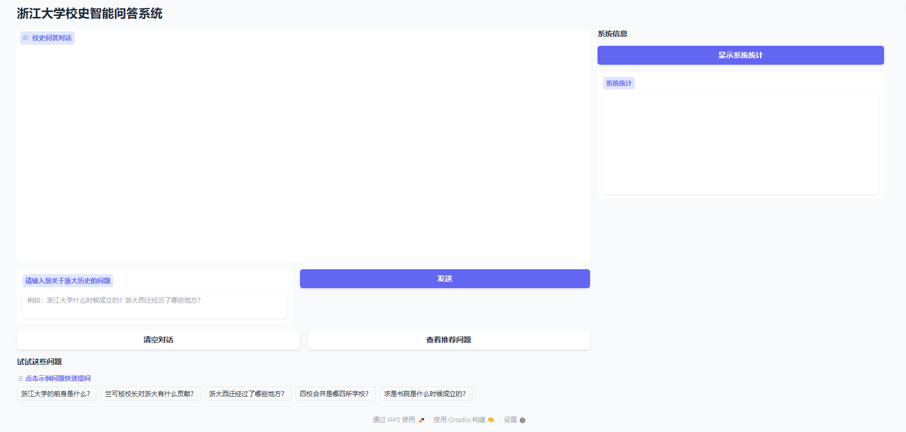
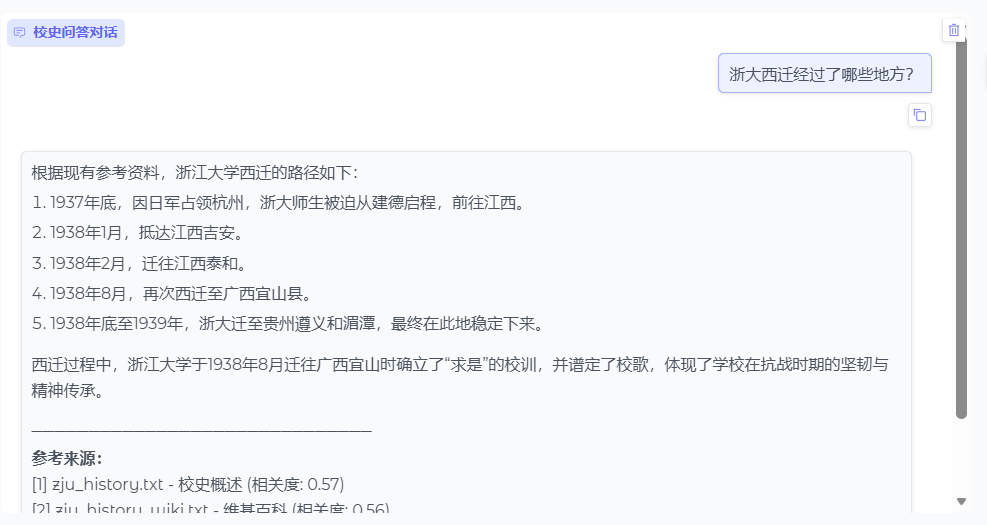

# 浙江大学校史智能问答系统

一个围绕“浙大校史”的检索增强问答（RAG）项目。项目将经过清洗和分块的校史文本存入本地向量数据库（ChromaDB），并通过本地 `Ollama` 模型（如 `deepseek-r1:latest`）进行回答生成，提供可直接运行的 Web 界面与最小化测试脚本。

## 特性
- 本地向量数据库（ChromaDB），持久化存储校史语料
- 简洁可维护的模块划分（`src/` 目录统一管理）
- 非流式稳定输出（默认），可按需切换流式
- Web 界面（Gradio）支持问答、推荐问题与简单统计
- 适配 `Ollama` 的 OpenAI 接口（`config.json` 中统一配置）

## 目录结构
```
zju_history_expert/
├── src/
│   ├── web_app.py                    # Web 启动入口
│   ├── llm_client.py                 # LLM 客户端与回答生成
│   ├── vector_db.py                  # 向量库封装（ChromaDB）
│   ├── build_vector_db.py            # 使用优化数据重建向量库
│   ├── data_processing/              # 数据处理模块
│   │   ├── __init__.py
│   │   ├── metadata_extractor.py     # 元数据提取（时间、人物、地点等）
│   │   └── semantic_chunker.py       # 语义分块（健壮分句方案）
│   └── tests/                        # 最小化测试脚本
│       ├── test_llm_direct.py        # 直连 LLM 生成测试
│       └── test_ollama.py            # Ollama 连接与生成测试
├── processed_data/                   # 处理后的数据（保留）
├── raw_data/                         # 原始数据（保留）
├── config.json                       # LLM 配置（Ollama/OpenAI）
├── requirements.txt                  # 项目依赖
├── .gitignore                        # 忽略本地与临时文件
└── chroma_db/                        # 向量库持久化（自动生成，已忽略）
```

## 环境准备
- Python 3.10+（建议）
- 已安装并运行 `Ollama`（Windows 可通过官方安装包）
- 拉取或可用 `deepseek-r1:latest` 模型

安装依赖：
```bash
pip install -r requirements.txt
```

## 配置说明
`config.json` 示例（默认适配 Ollama）
```json
{
  "llm": {
    "provider": "ollama",
    "api_key": "ollama",
    "base_url": "http://localhost:11434/v1",
    "model": "deepseek-r1:latest",
    "temperature": 0.7,
    "max_tokens": 2000
  }
}
```
- 如使用代理或 IPv6 导致连接异常，可将 `base_url` 中的 `localhost` 替换为 `127.0.0.1`
- 如模型不存在，先执行：`ollama pull deepseek-r1:latest`

## 构建向量库
使用优化后的分块数据重建向量库：
```bash
python src/build_vector_db.py
```
提示：`chroma_db/` 目录为向量库持久化目录，自动生成，已在 `.gitignore` 中忽略。

## 启动 Web
```bash
python src/web_app.py
```
启动成功后，访问：
```
http://127.0.0.1:<端口>   # 例如 7861/7862
```
端口占用时会自动尝试其它端口；也可通过环境变量指定端口：`GRADIO_SERVER_PORT=<端口>`。

## 系统截图
- 将截图文件放入 `assets/screenshots/` 目录
- 推荐文件名：
  - `home.png`（首页）
  - `query_example.png`（问答示例）
  - `stats.png`（系统统计）
- README 中的占位引用：
  - 
  - 
  - 
- 生成建议：
  - 启动 Web 后在浏览器中全屏截图，分辨率建议 ≥ 1280×720
  - 如需匿名处理，手动裁剪隐藏浏览器地址栏或系统托盘信息

## 最小化验证
- 直连 LLM 测试：
```bash
python src/tests/test_llm_direct.py
```
- Ollama 连接与生成测试：
```bash
python src/tests/test_ollama.py
```

## 常见问题
- 502/连接失败：检查本地代理与网络；将 `base_url` 改为 `http://127.0.0.1:11434/v1`；确认 `ollama serve` 正在运行、目标模型已拉取
- 端口冲突：修改 `GRADIO_SERVER_PORT` 或让程序自动选择端口
- GBK 编码问题：终端打印 emoji 可能报编码错误，本项目已尽量避免
- 引用来源显示“未知章节”：已统一从 `metadata.section_title/source` 读取，如果数据侧没有这两个字段，会显示默认值

## 提交到 GitHub
```bash
git init
git add .
git commit -m "feat: migrate to src/, cleanup, add web app"
git branch -M main
git remote add origin <你的仓库URL>
git push -u origin main
```

## 许可证
- 语料数据为教学与研究用途，请在合规范围内使用
- 代码以研究演示为主，如需商用请自行评估与完善

## 致谢
- 向浙江大学历史资料、社区贡献者以及开源工具（ChromaDB、Gradio、Ollama 等）致谢
